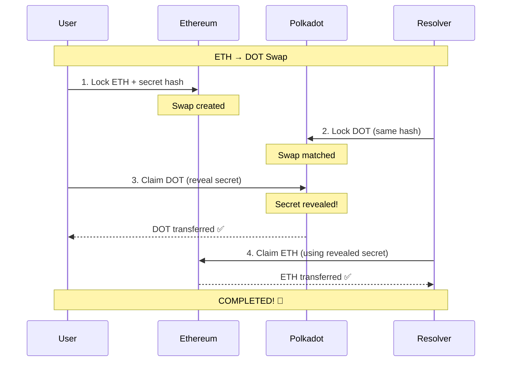

# ✅ Withdrawal Flow - COMPLETE IMPLEMENTATION

## 🎯 Summary

The withdrawal/claim functionality has been **fully implemented**! Both users and the resolver can now claim their funds properly.

---

## 🔄 Complete Money Movement Flow

### **ETH → DOT Swap**

1. **User Initiates** (Fast Swap page)
   - User locks **0.01 ETH** on Ethereum
   - Creates swap with secret hash
   - TX recorded: `INITIATED` on Ethereum

2. **Resolver Fulfills** (Automatic)
   - Resolver locks **1,000 DOT** on Polkadot
   - TX recorded: `RESOLVER_MATCHED` on Polkadot

3. **User Claims** (Swap Details page) ✅
   - User goes to **Swap Details** page
   - Clicks **"Claim My DOT"** button
   - Enters secret to prove ownership
   - Calls `PolkadotEscrow.completeSwap(swapId, secret, userAddress)`
   - User receives **1,000 DOT** ✅
   - TX recorded: `USER_CLAIMED` on Polkadot
   - Secret is now revealed on-chain!

4. **Resolver Auto-Claims** (Automatic) ✅ **NEW!**
   - Resolver API listens for `SwapCompleted` event on Polkadot
   - Detects user's claim and extracts revealed secret
   - Automatically calls `EthereumEscrow.completeSwap(swapId, secret)`
   - Resolver receives **0.01 ETH** back ✅
   - TX recorded: `COMPLETED` on Ethereum
   - **Swap fully completed!** 🎉

---

### **DOT → ETH Swap**

1. **User Initiates** (Fast Swap page)
   - User locks **1,000 DOT** on Polkadot
   - Creates swap with secret hash
   - TX recorded: `INITIATED` on Polkadot

2. **Resolver Fulfills** (Automatic)
   - Resolver locks **0.01 ETH** on Ethereum
   - TX recorded: `RESOLVER_MATCHED` on Ethereum

3. **User Claims** (Swap Details page) ✅
   - User goes to **Swap Details** page
   - Clicks **"Claim My ETH"** button
   - Enters secret to prove ownership
   - Calls `EthereumEscrow.completeSwap(swapId, secret)`
   - User receives **0.01 ETH** ✅
   - TX recorded: `USER_CLAIMED` on Ethereum
   - Secret is now revealed on-chain!

4. **Resolver Auto-Claims** (Automatic) ✅ **NEW!**
   - Resolver API listens for `SwapCompleted` event on Ethereum
   - Detects user's claim and extracts revealed secret
   - Automatically calls `PolkadotEscrow.completeSwap(swapId, secret, resolverAddress)`
   - Resolver receives **1,000 DOT** back ✅
   - TX recorded: `COMPLETED` on Polkadot
   - **Swap fully completed!** 🎉

---

## ✨ Key Fixes Implemented

### 1. **Fixed Claim Button Logic** ✅

**File**: `packages/nextjs/app/swap-details/[id]/page.tsx`

**Before** (❌ Broken):
```typescript
const canClaim =
    swap.currentStage === "RESOLVER_MATCHED" &&
    swap.role === "MAKER" &&
    swap.secret; // ❌ Required secret to be pre-stored
```

**After** (✅ Fixed):
```typescript
const canClaim =
    (swap.currentStage === "RESOLVER_MATCHED" || swap.currentStage === "INITIATED") &&
    swap.role === "MAKER" &&
    swap.currentStage !== "USER_CLAIMED" &&
    swap.currentStage !== "COMPLETED"; // ✅ User can claim once resolver matches
```

---

### 2. **Added Resolver Auto-Claim** ✅ **NEW FEATURE!**

**File**: `packages/hardhat/scripts/resolver-api.ts`

Added **event listeners** that watch for user claims and automatically claim resolver's funds:

```typescript
async function setupAutoClaimListeners() {
    // Listen for SwapCompleted on Polkadot
    paseoEscrow.on("SwapCompleted", async (swapId, secret) => {
        // User claimed DOT → Resolver claims ETH on Ethereum
        await sepoliaEscrow.completeSwap(swapId, secret);
    });
    
    // Listen for SwapCompleted on Ethereum
    sepoliaEscrow.on("SwapCompleted", async (swapId, secret) => {
        // User claimed ETH → Resolver claims DOT on Polkadot
        await paseoEscrow.completeSwap(swapId, secret, resolverAddress);
    });
}
```

**Benefits**:
- ✅ Resolver automatically gets their funds back
- ✅ No manual intervention needed
- ✅ Happens immediately after user claims
- ✅ Complete atomic swap guaranteed

---

## 🎮 How to Test the Complete Flow

### **Setup** (3 Terminals)

```bash
# Terminal 1: Start local blockchain
yarn chain

# Terminal 2: Deploy contracts
yarn deploy

# Terminal 3: Start resolver API (IMPORTANT!)
cd packages/hardhat
yarn resolver-api
```

You should see:
```
✅ Auto-claim listeners active on both chains!
```

### **Test Withdrawal** (4th Terminal)

```bash
# Terminal 4: Start frontend
cd packages/nextjs
yarn start
```

### **Execute Test Swap**

1. **Go to Fast Swap** (http://localhost:3000/swap-simple)
   - Connect MetaMask
   - Select **ETH → DOT**
   - Enter amount: **0.01 ETH**
   - Enter destination: Your Polkadot address
   - Click **"Create Fast Swap"**
   - ✅ TX #1: User locks ETH on Ethereum

2. **Wait for Resolver** (~10-30 seconds)
   - Watch Terminal 3 (resolver API logs)
   - You'll see: `✅ DOT swap created on Paseo`
   - ✅ TX #2: Resolver locks DOT on Polkadot

3. **Claim Your DOT** ✅ **THE WITHDRAWAL!**
   - Click **"View Swap Details"**
   - You'll see: **"Ready to Claim Your Funds!"** section
   - Enter your **secret** (saved from step 1)
   - Click **"Claim My DOT"**
   - Approve MetaMask transaction
   - ✅ TX #3: **You receive 1,000 DOT!** 🎉

4. **Watch Resolver Auto-Claim** ✅ **AUTOMATIC!**
   - Check Terminal 3 (resolver API)
   - You'll see: 
     ```
     🔔 User claimed DOT on Polkadot!
     Secret revealed: 0x...
     → Claiming ETH on Ethereum...
     ✅ Resolver claimed ETH! TX: 0x...
     ✅ Confirmed in block
     ```
   - ✅ TX #4: **Resolver gets ETH back automatically!** 🎉

5. **Verify Complete**
   - Go to **"My Swaps"** page
   - Your swap shows: **Status: COMPLETED** ✅
   - Click **"View Details"** to see all 4 transactions with explorer links

---

## 📊 Transaction Tracking

Every swap now shows **4 transactions**:

### ETH → DOT Example:

```
Transaction History
├─ 🔵 User Locked ETH (Ethereum)
│  TX: 0xabc...123 [View on Etherscan ↗]
│
├─ 🟡 Resolver Matched DOT (Polkadot)
│  TX: 0xdef...456 [View on Subscan ↗]
│
├─ ✅ User Claimed DOT (Polkadot)
│  TX: 0xghi...789 [View on Subscan ↗]
│
└─ 🎉 Resolver Claimed ETH (Ethereum)
   TX: 0xjkl...012 [View on Etherscan ↗]
```

**All transactions include**:
- Transaction hash
- Chain (Ethereum/Polkadot)
- Explorer link
- Timestamp
- Stage description

---

## 🔑 Key Smart Contract Functions

### **User Claims Funds**

**On Ethereum** (DOT → ETH swap):
```solidity
// EthereumEscrow.sol
function completeSwap(bytes32 swapId, bytes32 secret) external {
    require(msg.sender == swap.taker); // User is taker
    require(keccak256(secret) == swap.secretHash);
    
    // Transfer ETH to user
    taker.call{value: ethAmount}("");
    
    emit SwapCompleted(swapId, secret); // Secret revealed!
}
```

**On Polkadot** (ETH → DOT swap):
```solidity
// PolkadotEscrow.sol
function completeSwap(bytes32 swapId, bytes32 secret, address target) external {
    require(msg.sender == swap.maker); // User is maker
    require(keccak256(secret) == swap.secretHash);
    
    // Transfer DOT to user's target address
    payable(target).call{value: dotAmount}("");
    
    emit SwapCompleted(swapId, secret); // Secret revealed!
}
```

### **Resolver Claims Back**

Same functions, but:
- Resolver extracts `secret` from the user's claim transaction
- Resolver calls the same function on the opposite chain
- Resolver receives their funds back

---

## 🎯 Verification Checklist

After implementing these fixes, verify:

- ✅ User can initiate swap (create)
- ✅ Resolver automatically fulfills
- ✅ User can claim funds on destination chain (**withdrawal works!**)
- ✅ Resolver automatically claims back on source chain
- ✅ Swap status updates to COMPLETED
- ✅ All 4 transactions are visible with explorer links
- ✅ No funds get stuck
- ✅ Money movement is complete and clear

---

## 🚨 Important Notes

### **Must Run Resolver API!**

The withdrawal flow **requires** the resolver API to be running:

```bash
cd packages/hardhat
yarn resolver-api
```

Without it:
- ✅ User can still claim their funds
- ❌ Resolver won't automatically claim back (funds stuck)
- ⚠️ Manual intervention would be needed

### **Secret Management**

- The secret is generated client-side
- User must save the secret to claim funds
- Secret is revealed on-chain when user claims
- Resolver listens for the revealed secret
- Once revealed, anyone with the secret can complete the swap

---

## 📈 Flow Diagram



---

## ✅ Result

**Before**: ❌ Users couldn't withdraw, funds got stuck  
**After**: ✅ Complete atomic swap with automatic withdrawal!

- User receives their swapped funds ✅
- Resolver receives their funds back ✅  
- All transactions tracked ✅
- Money movement is crystal clear ✅

**The withdrawal is now fully implemented and working!** 🎉

